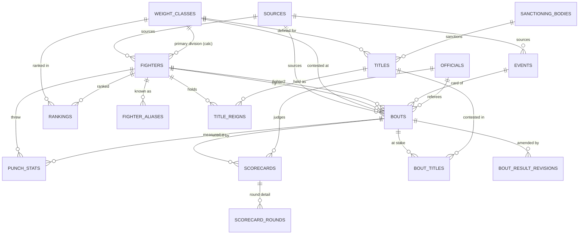

# PunchStats — Database Design

PostgreSQL 16. Schema managed by Drizzle with generated SQL migrations. Conventions: `snake_case`, UUIDv7 primary keys (`id`), `created_at`/`updated_at` timestamptz on every table, soft business keys via unique `slug` columns on publicly-routed entities (fighters, events, weight classes).

## Entity overview

| Entity | Purpose |
|---|---|
| `sources` | Where a piece of data came from (provenance) |
| `weight_classes` | Divisions (per gender), with limits |
| `fighters` | Canonical fighter records + denormalized calculated record |
| `fighter_aliases` | Nicknames, spellings, ring names (searchable) |
| `events` | Fight cards: date, venue, promoter |
| `bouts` | A single fight between two fighters on an event |
| `bout_result_revisions` | Audit trail for amended/overturned results |
| `officials` | Judges and referees (people, role assigned per bout) |
| `scorecards` / `scorecard_rounds` | Judge totals, optional per-round detail |
| `punch_stats` | Optional per-fighter-per-bout punch data |
| `sanctioning_bodies` / `titles` / `bout_titles` / `title_reigns` | Championship model |
| `rankings` | Dated editorial ranking snapshots per division |
| `admin_users` | The single admin login |

## Provenance and source tracking (cross-cutting)

Every content table (`fighters`, `events`, `bouts`, `scorecards`, `punch_stats`, `rankings`, `title_reigns`) carries:

- `source_id` → `sources(id)`, **NOT NULL**. You cannot save a record without saying where it came from.
- `verification_status` enum: `verified` | `unverified` | `user_submitted` | `disputed`. (*Calculated* is not a row status — calculated values are specific denormalized columns/derived fields, labeled as such in the UI.)

```sql
CREATE TABLE sources (
  id            uuid PRIMARY KEY,
  name          text NOT NULL,                -- "Manual entry — ESPN fight report 2025-09-13"
  kind          text NOT NULL CHECK (kind IN ('official','media_report','editorial','user_submission','licensed_feed')),
  url           text,
  license_notes text,                         -- REQUIRED by app policy for licensed_feed & images
  created_at    timestamptz NOT NULL DEFAULT now()
);
```

Row-level provenance (not field-level) is a deliberate simplification: field-level provenance triples write complexity for a distinction the UI can't meaningfully show yet. When two sources disagree on one field, the policy is: keep the better-sourced value, set `verification_status = 'disputed'`, note the conflict in the row's `notes`. Revisit if community submissions demand per-field merging.

## Tables

### `weight_classes`

| column | type | notes |
|---|---|---|
| `slug` | text | unique, e.g. `heavyweight`, `womens-featherweight` |
| `name` | text | "Heavyweight" |
| `gender` | enum `male` \| `female` | limits differ; divisions are per-gender rows |
| `limit_lbs` | numeric(5,1) | NULL for heavyweight (no upper limit) |
| `sort_order` | int | display order, heaviest first |

Seeded once (17 men's + women's divisions); effectively static reference data.

### `fighters`

| column | type | notes |
|---|---|---|
| `slug` | text | unique, `terence-crawford` (collision → `-2` suffix) |
| `full_name` | text NOT NULL | display name (most common ring name) |
| `birth_name` | text | if different |
| `nickname` | text | primary nickname for display; others in aliases |
| `birth_date` / `death_date` | date | nullable — many historical fighters lack exact dates |
| `nationality` | char(2) | ISO 3166-1; `residence_city`, `residence_country` separate |
| `stance` | enum `orthodox` \| `southpaw` \| `switch` | nullable |
| `height_cm` / `reach_cm` | smallint | store metric; format imperial in UI |
| `pro_debut_date` | date | nullable |
| `status` | enum `active` \| `inactive` \| `retired` \| `deceased` | |
| `primary_weight_class_id` | fk → weight_classes | **calculated**: division of most recent bout; recomputed on bout writes (see below) |
| `record_wins/losses/draws/no_contests/ko_wins` | smallint NOT NULL DEFAULT 0 | **calculated**, recomputed transactionally on bout changes |
| `bio` | text | markdown, short |
| `photo_key`, `photo_license`, `photo_attribution` | text | all-or-nothing (app-enforced) |
| `sex` | enum | must match divisions fought in (app-enforced) |
| `source_id`, `verification_status` | | provenance |

### `fighter_aliases`

`(id, fighter_id fk CASCADE, alias text, kind enum('nickname','ring_name','spelling_variant','birth_name'))`, unique `(fighter_id, lower(alias))`. Feeds search (see Indexes).

### `events`

| column | type | notes |
|---|---|---|
| `slug` | text unique | `crawford-vs-canelo-2025-09-13` (name + date keeps it unique and readable) |
| `name` | text | promotional name, "Riyadh Season: Crawford vs. Canelo" |
| `event_date` | date NOT NULL | local date of the card |
| `venue_name`, `city`, `region`, `country` (char(2)) | text | **deliberately denormalized** — a `venues` table is post-MVP; venue analytics aren't an MVP feature and normalizing now adds joins and admin friction |
| `promoter`, `broadcaster` | text | free text MVP |
| `status` | enum `scheduled` \| `completed` \| `canceled` \| `postponed` | |
| `poster_key` + license fields | | as with fighter photos |
| `source_id`, `verification_status` | | |

### `bouts`

The center of the schema. **Two explicit fighter columns**, not a participants join table — see tradeoff below.

| column | type | notes |
|---|---|---|
| `event_id` | fk → events NOT NULL | a bout always belongs to an event |
| `bout_order` | smallint NOT NULL | 1 = first fight of the night; **unique `(event_id, bout_order)`** |
| `billing` | enum `main_event` \| `co_main` \| `undercard` \| `prelim` | display grouping, independent of order |
| `fighter1_id`, `fighter2_id` | fk → fighters NOT NULL | CHECK `fighter1_id <> fighter2_id`. Convention: fighter1 = A-side/champion; presentation only, no result semantics |
| `weight_class_id` | fk → weight_classes NOT NULL | the division **of this bout** (this is how weight-class changes work) |
| `is_title_bout` | — | *not stored*; derived from `bout_titles` rows |
| `scheduled_rounds` | smallint NOT NULL | CHECK in (1..15) |
| `outcome` | enum `fighter1` \| `fighter2` \| `draw` \| `no_contest` \| NULL | NULL = not yet fought |
| `method` | enum `KO` \| `TKO` \| `RTD` \| `UD` \| `SD` \| `MD` \| `TD` \| `PTS` \| `DQ` \| NULL | `method_detail` text for color ("left hook to the body") |
| `ending_round` | smallint | NULL for full-distance decisions is *allowed* but app fills `scheduled_rounds` |
| `ending_time_seconds` | smallint | seconds into the round; NULL if unknown |
| `fighter1_weight_lbs`, `fighter2_weight_lbs` | numeric(5,1) | weigh-in weights, nullable |
| `fighter1_knockdowns`, `fighter2_knockdowns` | smallint | knockdowns *scored against* the named fighter's opponent... **convention: count = knockdowns this fighter SUFFERED**; nullable = unknown (≠ 0) |
| `referee_id` | fk → officials | nullable |
| `result_status` | enum `scheduled` \| `official` \| `under_review` \| `overturned_nc` \| `amended` | see revisions below |
| `notes` | text | |
| `source_id`, `verification_status` | | |

CHECK constraints: `(outcome IS NULL) = (result_status = 'scheduled')` shaped guards live in app-layer validation (Zod) rather than SQL where they'd get gnarly; SQL keeps the cheap ones (`fighter1 <> fighter2`, round ranges, non-negative counts).

**Tradeoff — two columns vs. participants table:** a `bout_participants` table is more normalized and would give per-fighter bout attributes a natural home, but every read becomes a double-join and "fight history" queries get harder to write and index. With exactly-two participants guaranteed by the sport, two columns + two composite indexes is simpler and fast. Cost accepted: fight-history queries use `WHERE fighter1_id = $x OR fighter2_id = $x` (served by two indexes, unioned by the planner), and per-fighter columns come in pairs. Migration to a participants table is mechanical if per-fighter attributes multiply (purses, odds, weights at multiple ceremonies).

### `bout_result_revisions` — amended & disputed results

Results change: failed drug tests turn wins into no-contests, appeals amend scorecards. The bout row always holds the **current official result**; revisions preserve history:

`(id, bout_id fk, changed_at date, previous_outcome, previous_method, new_outcome, new_method, reason text NOT NULL, ruled_by text /* "NSAC" */, source_id)`

The fight page renders these as a visible "Result history" timeline — a place where PunchStats can be *better* than incumbents. While a result is contested but not yet changed, `bouts.result_status = 'under_review'` flags it without altering the result.

### `officials`, `scorecards`, `scorecard_rounds`

- `officials`: `(id, full_name, slug unique)` — people; whether they judge or referee is per-bout, since many do both across a career.
- `scorecards`: `(id, bout_id fk, judge_id fk officials, fighter1_total smallint NOT NULL, fighter2_total smallint NOT NULL, source_id, verification_status)`, unique `(bout_id, judge_id)`. Totals are the MVP requirement — every decision result should show three judge totals.
- `scorecard_rounds`: `(id, scorecard_id fk CASCADE, round smallint, fighter1_score smallint, fighter2_score smallint)`, unique `(scorecard_id, round)`, CHECK scores in (0..10). **Optional** — per-round cards are often unpublished; the UI renders the round grid only when rows exist. No requirement that round sums equal totals in SQL (data errors in the wild are real; app warns admin on mismatch instead of refusing).

### `punch_stats` — incomplete by design

`(id, bout_id fk, fighter_id fk, total_thrown, total_landed, jab_thrown, jab_landed, power_thrown, power_landed — all int NULL, per_round jsonb NULL, coverage enum('complete','partial'), source_id NOT NULL, verification_status)`, unique `(bout_id, fighter_id)`.

Design rules:
1. **Absence of a row = no data**, and the UI says "Punch stats not available", never zeros.
2. Every column nullable — partial data (e.g., only totals) is stored as exactly what's known, with `coverage = 'partial'`.
3. `per_round` JSONB (`[{round:1, total_landed:…}, …]`) instead of a child table: this data is read-and-display-only in the MVP, never queried relationally. Promote to a table when round-level analytics become a feature.
4. **Legal gate:** CompuBox data is proprietary. `source_id` must point at a source whose `license_notes` establish the right to republish; app-level validation refuses `punch_stats` writes against sources of kind `media_report` without license notes. Realistic MVP assumption: **this table ships empty** and the UI proves the empty state.

### Titles: `sanctioning_bodies`, `titles`, `bout_titles`, `title_reigns`

- `sanctioning_bodies`: `(id, abbreviation unique /* WBA */, name, is_major bool)` — seeded: WBA, WBC, IBF, WBO, The Ring, IBO, lineal-as-body (pragmatic: treat "Lineal" and "The Ring" as bodies so the model stays uniform).
- `titles`: `(id, sanctioning_body_id fk, weight_class_id fk, name /* "WBC World Heavyweight" */)`, unique `(sanctioning_body_id, weight_class_id, name)`. Handles Regular/Super/Interim variants as distinct title rows — modeling body-specific title hierarchies structurally was rejected as over-engineering; the name disambiguates.
- `bout_titles`: `(bout_id fk, title_id fk, vacant_before bool)` PK `(bout_id, title_id)` — what was at stake in a bout; unification fights are just multiple rows.
- `title_reigns`: `(id, title_id fk, fighter_id fk, start_date, won_bout_id fk NULL, end_date NULL, end_reason enum('lost','vacated','stripped','retired') NULL, source_id, verification_status)`. **Admin-maintained, not derived** — deriving reigns from bout history requires complete bout history plus vacancy/stripping events that aren't bouts; with a curated dataset, manual reigns are more honest. Current champion = reign with `end_date IS NULL`.

### `rankings` — dated snapshots

`(id, weight_class_id fk, fighter_id fk, rank smallint, kind enum('editorial') /* future: body rankings */, as_of date NOT NULL, note text, source_id, verification_status)`

Unique `(weight_class_id, kind, as_of, rank)` and `(weight_class_id, kind, as_of, fighter_id)`. Rankings are **append-only snapshots**: publishing new rankings inserts a new `as_of` set; the division page shows the latest, history is queryable later. This is much simpler than mutable ranked lists with movement tracking, and movement (▲2) is *calculated* by diffing the two latest snapshots.

### `admin_users`

`(id, email unique, password_hash /* argon2id */, created_at)`. One row. Sessions are stateless signed cookies — no sessions table in MVP.

## Fighter aliases — how search uses them

Search must match "GGG" → Golovkin, "Cinnamon"… no, "Canelo" → Álvarez, and Cyrillic-origin spelling variants. All alternate names live in `fighter_aliases`; search queries the union of `fighters.full_name`, `fighters.nickname`, and `fighter_aliases.alias` with trigram similarity (unaccented). Canonical display always uses `fighters.full_name` — aliases only widen matching and render as "a.k.a." lines on the profile.

## Fighters changing weight classes

The division is an attribute of the **bout**, not the fighter. Career-spanning reality (Pacquiao: flyweight → welterweight) falls out of the data for free: profile pages can group or annotate the fight history by division, and "divisions fought in" is a `SELECT DISTINCT`. `fighters.primary_weight_class_id` is a denormalized convenience (division of the most recent bout, admin-overridable) used for directory filtering and rankings context — labeled calculated.

## Indexes

```sql
-- Fight history (the hottest query): both directions
CREATE INDEX bouts_f1_date ON bouts (fighter1_id, event_id);
CREATE INDEX bouts_f2_date ON bouts (fighter2_id, event_id);
CREATE INDEX bouts_event ON bouts (event_id, bout_order);

-- Directory & filtering
CREATE INDEX fighters_division ON fighters (primary_weight_class_id) WHERE status = 'active';
CREATE INDEX events_date ON events (event_date DESC);

-- Search: fuzzy names (pg_trgm + unaccent extensions)
CREATE INDEX fighters_name_trgm  ON fighters USING gin (immutable_unaccent(full_name) gin_trgm_ops);
CREATE INDEX aliases_trgm        ON fighter_aliases USING gin (immutable_unaccent(alias) gin_trgm_ops);
CREATE INDEX events_search_tsv   ON events USING gin (search_tsv);  -- generated tsvector(name, venue_name, city)

-- Rankings: latest snapshot per division
CREATE INDEX rankings_latest ON rankings (weight_class_id, kind, as_of DESC, rank);

-- Slugs are unique indexes by definition; child tables get FK indexes (scorecards.bout_id, etc.)
```

(`immutable_unaccent` is the standard immutable wrapper function around `unaccent`, created in migration 0001, required to index accented names like "Álvarez".)

Note: because bout dates come from `events.event_date`, fight-history ordering joins events; at MVP volume this is fine. If it ever isn't, denormalize `bout_date` onto bouts — recorded as a known, cheap escape hatch.

## Entity-relationship diagram



## Data-quality risks to design around

1. **Historical incompleteness is normal.** Nullable is the default posture (birth dates, reach, weights, ending times). UI must render "—", never fake precision.
2. **Name collisions** (two "Josh Taylor"s exist in boxing). Slugs get numeric suffixes; disambiguation is by division/nationality in search results.
3. **Conflicting reports** on results/scorecards in old fights → `verification_status = 'disputed'` + notes; never silently pick.
4. **The seed dataset itself** is the biggest data-quality risk: hand-entry introduces typos. Mitigation: Zod validation everywhere, plus a `pnpm db:audit` script (roadmap slice 7) checking invariants (records sum correctly, decision bouts have scorecards, ending_round ≤ scheduled_rounds).
