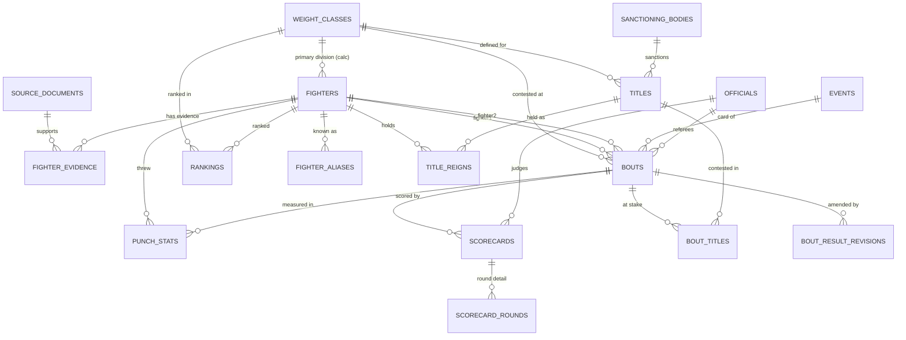

# PunchStats — Database Design

PostgreSQL 16. Schema managed by Drizzle with generated SQL migrations. Conventions: `snake_case`, UUIDv7 primary keys (`id`), `created_at`/`updated_at` timestamptz on every table, soft business keys via unique `slug` columns on publicly-routed entities (fighters, events, weight classes).

## Entity overview

| Entity | Purpose |
|---|---|
| `source_documents` | A specific retrieved source document (provenance) |
| `weight_classes` | Divisions (per gender), with limits |
| `fighters` | Canonical fighter records + denormalized calculated record |
| `fighter_evidence` | Field- or entity-level citations for `fighters` (Tier 2 provenance — see below) |
| `fighter_aliases` | Nicknames, spellings, ring names (searchable) |
| `events` | Fight cards: date, venue, promoter |
| `bouts` | A single fight between two fighters on an event |
| `bout_result_revisions` | Audit trail for amended/overturned results |
| `officials` | Judges and referees (people, role assigned per bout) |
| `scorecards` / `scorecard_rounds` | Judge totals, optional per-round detail |
| `punch_stats` | Optional per-fighter-per-bout punch data |
| `sanctioning_bodies` / `titles` / `bout_titles` / `title_reigns` | Championship model |
| `rankings` | Dated editorial ranking snapshots per division |
| `admin_users` | The single admin login |

`event_evidence`, `bout_evidence`, and similar Tier 2 evidence tables join this list as their parent entities ship — see "Provenance and evidence model" below.

## Provenance and evidence model (cross-cutting)

The original design put a single `source_id` + `verification_status` pair directly on every content table, implying one source explains an entire row. That's wrong for any entity that aggregates facts gathered at different times from different places — a fighter's birth date might come from an athletic commission license, their reach from a promoter's press kit, and their photo from Wikimedia Commons. Forcing all three under one `source_id` means either picking one source arbitrarily or overwriting it every time a better source turns up, silently discarding the earlier citation. This section replaces that model — see [ADR-013](DECISIONS.md) in DECISIONS.md for the full alternatives analysis (supersedes the original ADR-005).

### Two tiers, not one universal table

Not every table needs the same amount of provenance machinery. This schema uses two tiers, chosen per table based on whether a row represents one atomic fact or aggregates many:

**Tier 1 — atomic fact tables.** A row *is* the fact — a scorecard row is one judge's totals for one bout; a ranking row is one fighter's rank in one dated snapshot. One citation legitimately explains the whole row. These tables keep two plain columns, directly on the row:

- `source_document_id` → `source_documents(id)` (nullable, except `punch_stats` — see the legal gate in its section below)
- `verification_status` (shared enum: `verified` | `unverified` | `user_submitted` | `disputed`)

This is the same shape the original design used everywhere — it just now points at a richer `source_documents` table (below) and is only applied where the "one source, one row" assumption is actually true. **Tier 1 tables:** `fighter_aliases`, `scorecards`, `punch_stats`, `rankings`, `title_reigns`, `bout_result_revisions`.

**Tier 2 — multi-field entities.** A row aggregates independent facts that arrive at different times from different sources and can genuinely disagree with each other. These tables carry **no** `source_id`/`verification_status` columns at all. Instead, a companion `<entity>_evidence` table holds one row per *claim* about one field (or the entity generally), so conflicting claims coexist instead of competing for a single column. **Tier 2 tables:** `fighters` (ships in Slice 1B, via `fighter_evidence`); `events` and `bouts` (once they exist — see "Extension path" below).

Two tables need neither tier: `weight_classes` (sport-rule reference data — the divisions and poundage limits are defined by the sport itself, not sourced from a reporter) and `scorecard_rounds` (a round score has no independent existence apart from its parent scorecard — it inherits that row's provenance).

### `source_documents` — a specific retrieved source, not a publisher

```sql
CREATE TYPE source_type AS ENUM ('official', 'media_report', 'editorial', 'user_submission', 'licensed_feed');

CREATE TABLE source_documents (
  id             uuid PRIMARY KEY,
  publisher      text NOT NULL,       -- "Nevada Athletic Commission", "ESPN", "PunchStats Editorial"
  title          text,                -- the specific document/article/report's title, if it has one
  url            text,                -- nullable — see "Unavailable URLs" below
  source_type    source_type NOT NULL,
  published_at   date,                -- when the source itself was published/issued
  retrieved_at   date,                -- when PunchStats staff actually accessed/archived it
  license_name   text,                -- e.g. "CC BY-SA 4.0", "All rights reserved"
  license_url    text,
  license_notes  text,                -- REQUIRED (app-enforced) for licensed_feed sources and any image
  archived_url   text,                -- Wayback Machine / archive.today snapshot
  created_at     timestamptz NOT NULL DEFAULT now(),
  updated_at     timestamptz NOT NULL DEFAULT now()
);
```

Each row is **one specific retrieved document** ("ESPN's fight report on the Crawford–Canelo card, retrieved 2025-09-14"), not a generic publisher record — the same publisher (ESPN) gets a new `source_documents` row for every distinct article/report cited, because `published_at`/`retrieved_at`/`url`/`archived_url` are properties of the document, not the outlet. This is what makes the model auditable: you can always answer "which specific page said this?", not just "which outlet?"

### `fighter_evidence` — the first (and, for Slice 1B, only) Tier 2 evidence table

```sql
CREATE TYPE verification_status AS ENUM ('verified', 'unverified', 'user_submitted', 'disputed');
CREATE TYPE confidence_level AS ENUM ('high', 'medium', 'low');

CREATE TABLE fighter_evidence (
  id                   uuid PRIMARY KEY,
  fighter_id           uuid NOT NULL REFERENCES fighters(id) ON DELETE CASCADE,
  field_name           text,                -- NULL = whole-fighter claim; else a specific column, e.g. 'birth_date'
  source_document_id   uuid NOT NULL REFERENCES source_documents(id),
  source_value         text,                -- the value as that source reported it, verbatim
  verification_status  verification_status NOT NULL DEFAULT 'unverified',
  confidence           confidence_level,    -- editor's trust in this specific claim — independent of verification_status
  notes                text,
  verified_by          text,                -- free text for now; becomes a FK to admin_users once that table exists (Slice 7)
  verified_at          timestamptz,
  created_at           timestamptz NOT NULL DEFAULT now(),
  updated_at           timestamptz NOT NULL DEFAULT now()
);

CREATE INDEX fighter_evidence_fighter ON fighter_evidence (fighter_id);
CREATE INDEX fighter_evidence_source  ON fighter_evidence (source_document_id);
```

`verified_by` is free text rather than a foreign key because `admin_users` doesn't exist until Slice 7 — a follow-up migration should add `verified_by_admin_user_id` once multi-admin auth ships, backfilling from the free-text values where possible. Flagged here so it isn't forgotten.

### Why per-domain evidence tables, not one generic polymorphic table

The obvious "just make it fully generic" design is a single `entity_evidence` table with `entity_type text` + `entity_id uuid` columns, so every Tier 2 entity shares one physical table. That was the first sketch of this fix (see the earlier draft of [SLICE_1_FOUNDATION.md](SLICE_1_FOUNDATION.md)). It's rejected here:

- **Postgres cannot enforce a foreign key across a polymorphic `(entity_type, entity_id)` pair.** Nothing stops an `entity_id` from pointing at a row that was deleted, or never existed, in whatever table `entity_type` names. Referential integrity becomes an application-level promise instead of a database guarantee — a real cost on a project whose whole design philosophy (CHECK constraints, NOT NULL, unique indexes throughout this document) is "let Postgres enforce it."
- **Deletes don't cascade.** Deleting a fighter would orphan its evidence rows silently unless the app remembers to clean them up separately; with a real FK (`fighter_id REFERENCES fighters(id) ON DELETE CASCADE`), the database does it for free.
- **The cost of the alternative (one small table per Tier 2 entity) is low and mechanical.** Adding `bout_evidence` when `bouts` ships in Slice 5 is a short migration that copies `fighter_evidence`'s shape verbatim — about the same effort as adding the `bouts` table itself, and Drizzle's schema-as-code migration generation makes this cheap every time.

A middle option was also considered and rejected for now: a shared "anchor" table (every Tier 2 entity gets a row in a central `provenance_subjects` registry, and both the entity table and `entity_evidence` FK to that registry's surrogate key). This would give one physical evidence table *with* real referential integrity, but at the cost of a mandatory extra insert (and extra join on every read) for every Tier 2 entity, for a benefit — one shared table instead of a few near-identical ones — that doesn't matter until there are many more Tier 2 entity types than this project has. Revisit if the number of `<entity>_evidence` tables grows past six or seven and the duplication becomes the bigger cost.

### Extension path for `events` and `bouts`

`events` and `bouts` aren't built until Slices 4 and 5. When they are, they follow the same Tier 2 pattern as `fighters`: no `source_id`/`verification_status` columns on the table itself, and a companion `event_evidence` / `bout_evidence` table shaped exactly like `fighter_evidence` (swap the FK column name). This is why the two tables' specs further down this document show no provenance columns and a forward-reference instead — building `bout_evidence` today, before `bouts` exists, would be speculative.

### How evidence supports a whole entity vs. one field

`field_name IS NULL` on a `fighter_evidence` row means "this evidence supports the fighter generally" (e.g., an entire biographical write-up used as the basis for the profile at creation time). A non-null `field_name` (e.g. `'birth_date'`, `'reach_cm'`, `'nationality'`) means the evidence is scoped to that one column. Both live in the same table; nothing else distinguishes them.

### How conflicting sources are stored without overwriting history

Two `fighter_evidence` rows can cite different values for the same `(fighter_id, field_name)` from different `source_document_id`s — both persist. Nothing is ever overwritten to "resolve" a conflict; the resolution is a *separate act* (below), and the losing evidence row stays in the table, now representing "what we used to believe and why," not deleted or silently superseded. The same principle already governs `bout_result_revisions` elsewhere in this schema — this extends it to biographical facts.

### How one canonical displayed value is selected

The base entity's own column (`fighters.birth_date`, etc.) is **always** the single value the UI displays and the database queries against — that hasn't changed. What's new is how it's justified. When evidence conflicts, an editor chooses which claim is authoritative by marking exactly one matching evidence row's `verification_status = 'verified'` and writing its value into the canonical column in the same transaction; any other rows for that field keep whatever status they already had (typically `disputed` or `unverified`) rather than being deleted. The `ProvenanceBadge` component (see [DESIGN_SYSTEM.md](DESIGN_SYSTEM.md)) reads: if any evidence row for a field is `disputed`, show *disputed* regardless of other rows (sources disagreeing is itself worth surfacing); else if any row is `verified`, show *verified*; else if any is `user_submitted`, show *user-submitted*; else *unverified*.

### How corrections and changed information are handled

For Tier 2 fields: a correction is a **new** `fighter_evidence` row citing the new source, plus an update to the canonical column — the old evidence row is never edited or deleted, so "why did this used to say something else" stays answerable. For Tier 1 tables, the row itself can be corrected directly (there's no independent sub-history to preserve for a single atomic fact), with the reason logged in that table's `notes` column; results specifically still go through the existing `bout_result_revisions` mechanism unchanged, since a bout's result has product-visible revision history of its own (the "Result history" timeline).

### Provenance vs. verification status vs. licensing vs. confidence — four different questions

- **Provenance** — *where did this value come from?* Answered by the `source_document_id` link (and, for Tier 2 fields, `source_value` holding the value exactly as that source reported it, which may differ in format or units from the canonical column).
- **Verification status** — *how much should the reader trust this specific claim, and has anyone reviewed it?* A property of the evidence row (Tier 2) or the fact row itself (Tier 1) — the same source document can back one `verified` fact and one `disputed` fact.
- **Confidence** — *independent of review workflow, how sure is the editor this specific claim is accurate?* Only meaningful on Tier 2 evidence rows, where a single fact might be reviewed (`verified`) yet still come from a source the editor personally finds shaky (`confidence = 'low'`) with nothing better available.
- **Licensing** — *are we legally allowed to reuse this source's content?* Lives entirely on `source_documents` (`license_name`, `license_url`, `license_notes`), because a license is a property of the source material itself, applying uniformly to everything cited from it — not a property of any individual fact extracted from it.

### How calculated values reference their input evidence

They don't. `fighters.record_wins`/`losses`/`draws`/`ko_wins` and similar denormalized columns are computed by the application from other rows (bouts, once Slice 3 ships) — never sourced, never given an evidence row, and never carry a `verification_status`. They're rendered with the separate *calculated* badge established in [DESIGN_SYSTEM.md](DESIGN_SYSTEM.md) and [PRODUCT.md](PRODUCT.md), which is not part of this provenance model at all — it's a property of how the value was produced (derived vs. sourced), not how trustworthy it is.

### How manual editorial entry is represented

Even a fact with no external citation — an editor's own judgment call, like which fighter is currently "the" lineal champion in a disputed division — still requires a `source_documents` row: `source_type = 'editorial'`, `publisher = 'PunchStats Editorial'`, `url` left NULL, and `notes` explaining the reasoning. This preserves the original design's core invariant ("you cannot cite a fact without saying where it came from") even when "where it came from" is "we decided this," by making that decision itself a citable, timestamped record rather than a silent default.

### How unavailable source URLs or archived documents are handled

`url` is nullable — some legitimate sources (an old print report, a phone confirmation with a commission, the editorial case above) have no working link at all; `publisher`, `title`, and `notes` still identify what was consulted. `archived_url` is a separate nullable column for a Wayback Machine/archive.today snapshot, recorded at entry time specifically to survive link rot on sources that *do* have a URL today but may not tomorrow. Policy (app-level, not DB-enforced): admins are encouraged to snapshot anything backing an identity-defining fact (birth date, record, title reigns) at the time it's cited.

### What Slice 1B actually builds vs. what's specified for later

Slice 1B ships exactly `source_documents` and `fighter_evidence` — the only Tier 2 entity that exists yet is `fighters`. Every Tier 1 table described in this document (`scorecards`, `punch_stats`, `rankings`, `title_reigns`, `bout_result_revisions`) is specified with its future `source_document_id`/`verification_status` columns for consistency, but none of those tables are built until the slice that introduces them (3, 5, or 6 — see [ROADMAP.md](ROADMAP.md)). `fighter_aliases` *does* ship in Slice 1B (below) and gets its Tier 1 columns now, even though Slice 1B's fixtures are fictional and won't populate them meaningfully yet.

**A tradeoff worth naming:** removing `source_id NOT NULL` from `fighters` means the database itself no longer guarantees every fighter has a citation — that guarantee now lives at the service layer (the fighter-creation transaction should insert the fighter row and at least one general `fighter_evidence` row together) rather than as a SQL constraint. This is the accepted cost of supporting multiple, independently-verifiable sources per entity; it did not exist as a real risk under the old model only because the old model couldn't express multiple sources at all.

## Tables

### `weight_classes`

| column | type | notes |
|---|---|---|
| `slug` | text | unique, e.g. `heavyweight`, `womens-featherweight` |
| `name` | text | "Heavyweight" |
| `gender` | enum `male` \| `female` | limits differ; divisions are per-gender rows |
| `limit_lbs` | numeric(5,1) | NULL for heavyweight (no upper limit) |
| `sort_order` | int | display order, heaviest first |

Seeded once (17 men's + women's divisions); effectively static reference data. No provenance columns — see "Two tiers" above.

### `fighters`

| column | type | notes |
|---|---|---|
| `slug` | text | unique, `terence-crawford` (collision → `-2` suffix) |
| `full_name` | text NOT NULL | display name (most common ring name) |
| `birth_name` | text | if different |
| `nickname` | text | primary nickname for display; others in aliases |
| `birth_date` / `death_date` | date | nullable — many historical fighters lack exact dates |
| `nationality` | char(2) | ISO 3166-1; `residence_city`, `residence_country` separate |
| `stance` | enum `orthodox` \| `southpaw` \| `switch` | nullable |
| `height_cm` / `reach_cm` | smallint | store metric; format imperial in UI |
| `pro_debut_date` | date | nullable |
| `status` | enum `active` \| `inactive` \| `retired` \| `deceased` | |
| `primary_weight_class_id` | fk → weight_classes | **calculated**: division of most recent bout; recomputed on bout writes (see below) |
| `record_wins/losses/draws/no_contests/ko_wins` | smallint NOT NULL DEFAULT 0 | **calculated**, recomputed transactionally on bout changes |
| `bio` | text | markdown, short |
| `photo_key`, `photo_license`, `photo_attribution` | text | all-or-nothing (app-enforced) |
| `sex` | enum | must match divisions fought in (app-enforced) |

**No direct provenance columns.** `fighters` is a Tier 2 multi-field entity — citations live in `fighter_evidence` (see "Provenance and evidence model" above), not on this row.

### `fighter_aliases`

`(id, fighter_id fk CASCADE, alias text, kind enum('nickname','ring_name','spelling_variant','birth_name'), source_document_id fk → source_documents nullable, verification_status enum default 'unverified')`, unique `(fighter_id, lower(alias))`. Tier 1 (atomic fact) — one alias, one citation. Feeds search (see Indexes).

### `events`

| column | type | notes |
|---|---|---|
| `slug` | text unique | `crawford-vs-canelo-2025-09-13` (name + date keeps it unique and readable) |
| `name` | text | promotional name, "Riyadh Season: Crawford vs. Canelo" |
| `event_date` | date NOT NULL | local date of the card |
| `venue_name`, `city`, `region`, `country` (char(2)) | text | **deliberately denormalized** — a `venues` table is post-MVP; venue analytics aren't an MVP feature and normalizing now adds joins and admin friction |
| `promoter`, `broadcaster` | text | free text MVP |
| `status` | enum `scheduled` \| `completed` \| `canceled` \| `postponed` | |
| `poster_key` + license fields | | as with fighter photos |

**No direct provenance columns yet.** `events` is a Tier 2 entity; an `event_evidence` table (shaped like `fighter_evidence`) ships alongside this table in Slice 4 — see "Extension path" above. Not built in Slice 1B.

### `bouts`

The center of the schema. **Two explicit fighter columns**, not a participants join table — see tradeoff below.

| column | type | notes |
|---|---|---|
| `event_id` | fk → events NOT NULL | a bout always belongs to an event |
| `bout_order` | smallint NOT NULL | 1 = first fight of the night; **unique `(event_id, bout_order)`** |
| `billing` | enum `main_event` \| `co_main` \| `undercard` \| `prelim` | display grouping, independent of order |
| `fighter1_id`, `fighter2_id` | fk → fighters NOT NULL | CHECK `fighter1_id <> fighter2_id`. Convention: fighter1 = A-side/champion; presentation only, no result semantics |
| `weight_class_id` | fk → weight_classes NOT NULL | the division **of this bout** (this is how weight-class changes work) |
| `is_title_bout` | — | *not stored*; derived from `bout_titles` rows |
| `scheduled_rounds` | smallint NOT NULL | CHECK in (1..15) |
| `outcome` | enum `fighter1` \| `fighter2` \| `draw` \| `no_contest` \| NULL | NULL = not yet fought |
| `method` | enum `KO` \| `TKO` \| `RTD` \| `UD` \| `SD` \| `MD` \| `TD` \| `PTS` \| `DQ` \| NULL | `method_detail` text for color ("left hook to the body") |
| `ending_round` | smallint | NULL for full-distance decisions is *allowed* but app fills `scheduled_rounds` |
| `ending_time_seconds` | smallint | seconds into the round; NULL if unknown |
| `fighter1_weight_lbs`, `fighter2_weight_lbs` | numeric(5,1) | weigh-in weights, nullable |
| `fighter1_knockdowns`, `fighter2_knockdowns` | smallint | knockdowns *scored against* the named fighter's opponent... **convention: count = knockdowns this fighter SUFFERED**; nullable = unknown (≠ 0) |
| `referee_id` | fk → officials | nullable |
| `result_status` | enum `scheduled` \| `official` \| `under_review` \| `overturned_nc` \| `amended` | see revisions below |
| `notes` | text | |

**No direct provenance columns yet.** `bouts` is a Tier 2 entity; a `bout_evidence` table (shaped like `fighter_evidence`) ships alongside this table in Slice 5 — see "Extension path" above. Not built in Slice 1B.

CHECK constraints: `(outcome IS NULL) = (result_status = 'scheduled')` shaped guards live in app-layer validation (Zod) rather than SQL where they'd get gnarly; SQL keeps the cheap ones (`fighter1 <> fighter2`, round ranges, non-negative counts).

**Tradeoff — two columns vs. participants table:** a `bout_participants` table is more normalized and would give per-fighter bout attributes a natural home, but every read becomes a double-join and "fight history" queries get harder to write and index. With exactly-two participants guaranteed by the sport, two columns + two composite indexes is simpler and fast. Cost accepted: fight-history queries use `WHERE fighter1_id = $x OR fighter2_id = $x` (served by two indexes, unioned by the planner), and per-fighter columns come in pairs. Migration to a participants table is mechanical if per-fighter attributes multiply (purses, odds, weights at multiple ceremonies).

### `bout_result_revisions` — amended & disputed results

Results change: failed drug tests turn wins into no-contests, appeals amend scorecards. The bout row always holds the **current official result**; revisions preserve history:

`(id, bout_id fk, changed_at date, previous_outcome, previous_method, new_outcome, new_method, reason text NOT NULL, ruled_by text /* "NSAC" */, source_document_id fk → source_documents nullable)`. Tier 1 — one citation per revision.

The fight page renders these as a visible "Result history" timeline — a place where PunchStats can be *better* than incumbents. While a result is contested but not yet changed, `bouts.result_status = 'under_review'` flags it without altering the result.

### `officials`, `scorecards`, `scorecard_rounds`

- `officials`: `(id, full_name, slug unique)` — people; whether they judge or referee is per-bout, since many do both across a career.
- `scorecards`: `(id, bout_id fk, judge_id fk officials, fighter1_total smallint NOT NULL, fighter2_total smallint NOT NULL, source_document_id fk → source_documents nullable, verification_status enum)`, unique `(bout_id, judge_id)`. Tier 1. Totals are the MVP requirement — every decision result should show three judge totals.
- `scorecard_rounds`: `(id, scorecard_id fk CASCADE, round smallint, fighter1_score smallint, fighter2_score smallint)`, unique `(scorecard_id, round)`, CHECK scores in (0..10). **No source column** — inherits provenance from its parent `scorecards` row; a round score has no independent existence apart from the card it belongs to. **Optional** — per-round cards are often unpublished; the UI renders the round grid only when rows exist. No requirement that round sums equal totals in SQL (data errors in the wild are real; app warns admin on mismatch instead of refusing).

### `punch_stats` — incomplete by design

`(id, bout_id fk, fighter_id fk, total_thrown, total_landed, jab_thrown, jab_landed, power_thrown, power_landed — all int NULL, per_round jsonb NULL, coverage enum('complete','partial'), source_document_id fk → source_documents NOT NULL, verification_status enum)`, unique `(bout_id, fighter_id)`. Tier 1.

Design rules:
1. **Absence of a row = no data**, and the UI says "Punch stats not available", never zeros.
2. Every numeric column nullable — partial data (e.g., only totals) is stored as exactly what's known, with `coverage = 'partial'`.
3. `per_round` JSONB (`[{round:1, total_landed:…}, …]`) instead of a child table: this data is read-and-display-only in the MVP, never queried relationally. Promote to a table when round-level analytics become a feature.
4. **Legal gate:** CompuBox data is proprietary. `source_document_id` must point at a `source_documents` row whose `license_name`/`license_notes` establish the right to republish; app-level validation refuses `punch_stats` writes referencing a `source_documents` row of `source_type = 'media_report'` without license notes. Realistic MVP assumption: **this table ships empty** and the UI proves the empty state.

### Titles: `sanctioning_bodies`, `titles`, `bout_titles`, `title_reigns`

- `sanctioning_bodies`: `(id, abbreviation unique /* WBA */, name, is_major bool)` — seeded: WBA, WBC, IBF, WBO, The Ring, IBO, lineal-as-body (pragmatic: treat "Lineal" and "The Ring" as bodies so the model stays uniform).
- `titles`: `(id, sanctioning_body_id fk, weight_class_id fk, name /* "WBC World Heavyweight" */)`, unique `(sanctioning_body_id, weight_class_id, name)`. Handles Regular/Super/Interim variants as distinct title rows — modeling body-specific title hierarchies structurally was rejected as over-engineering; the name disambiguates.
- `bout_titles`: `(bout_id fk, title_id fk, vacant_before bool)` PK `(bout_id, title_id)` — what was at stake in a bout; unification fights are just multiple rows.
- `title_reigns`: `(id, title_id fk, fighter_id fk, start_date, won_bout_id fk NULL, end_date NULL, end_reason enum('lost','vacated','stripped','retired') NULL, source_document_id fk → source_documents nullable, verification_status enum)`. Tier 1. **Admin-maintained, not derived** — deriving reigns from bout history requires complete bout history plus vacancy/stripping events that aren't bouts; with a curated dataset, manual reigns are more honest. Current champion = reign with `end_date IS NULL`.

### `rankings` — dated snapshots

`(id, weight_class_id fk, fighter_id fk, rank smallint, kind enum('editorial') /* future: body rankings */, as_of date NOT NULL, note text, source_document_id fk → source_documents nullable, verification_status enum)`. Tier 1.

Unique `(weight_class_id, kind, as_of, rank)` and `(weight_class_id, kind, as_of, fighter_id)`. Rankings are **append-only snapshots**: publishing new rankings inserts a new `as_of` set; the division page shows the latest, history is queryable later. This is much simpler than mutable ranked lists with movement tracking, and movement (▲2) is *calculated* by diffing the two latest snapshots.

### `admin_users`

`(id, email unique, password_hash /* argon2id */, created_at)`. One row. Sessions are stateless signed cookies — no sessions table in MVP.

## Fighter aliases — how search uses them

Search must match "GGG" → Golovkin, "Cinnamon"… no, "Canelo" → Álvarez, and Cyrillic-origin spelling variants. All alternate names live in `fighter_aliases`; search queries the union of `fighters.full_name`, `fighters.nickname`, and `fighter_aliases.alias` with trigram similarity (unaccented). Canonical display always uses `fighters.full_name` — aliases only widen matching and render as "a.k.a." lines on the profile.

## Fighters changing weight classes

The division is an attribute of the **bout**, not the fighter. Career-spanning reality (Pacquiao: flyweight → welterweight) falls out of the data for free: profile pages can group or annotate the fight history by division, and "divisions fought in" is a `SELECT DISTINCT`. `fighters.primary_weight_class_id` is a denormalized convenience (division of the most recent bout, admin-overridable) used for directory filtering and rankings context — labeled calculated.

## Indexes

```sql
-- Fight history (the hottest query): both directions
CREATE INDEX bouts_f1_date ON bouts (fighter1_id, event_id);
CREATE INDEX bouts_f2_date ON bouts (fighter2_id, event_id);
CREATE INDEX bouts_event ON bouts (event_id, bout_order);

-- Directory & filtering
CREATE INDEX fighters_division ON fighters (primary_weight_class_id) WHERE status = 'active';
CREATE INDEX events_date ON events (event_date DESC);

-- Search: fuzzy names (pg_trgm + unaccent extensions)
CREATE INDEX fighters_name_trgm  ON fighters USING gin (immutable_unaccent(full_name) gin_trgm_ops);
CREATE INDEX aliases_trgm        ON fighter_aliases USING gin (immutable_unaccent(alias) gin_trgm_ops);
CREATE INDEX events_search_tsv   ON events USING gin (search_tsv);  -- generated tsvector(name, venue_name, city)

-- Rankings: latest snapshot per division
CREATE INDEX rankings_latest ON rankings (weight_class_id, kind, as_of DESC, rank);

-- Provenance lookups (Tier 2)
CREATE INDEX fighter_evidence_fighter ON fighter_evidence (fighter_id);
CREATE INDEX fighter_evidence_source  ON fighter_evidence (source_document_id);

-- Slugs are unique indexes by definition; child tables get FK indexes (scorecards.bout_id, etc.)
```

(`immutable_unaccent` is the standard immutable wrapper function around `unaccent`, created in a Slice 2 migration, required to index accented names like "Álvarez". Not part of Slice 1B — see [SLICE_1_FOUNDATION.md](SLICE_1_FOUNDATION.md).)

Note: because bout dates come from `events.event_date`, fight-history ordering joins events; at MVP volume this is fine. If it ever isn't, denormalize `bout_date` onto bouts — recorded as a known, cheap escape hatch.

## Entity-relationship diagram



`event_evidence` / `bout_evidence` join this diagram once `events` / `bouts` ship (Slices 4–5) — not drawn yet since their parent entities don't exist. Tier 1 tables' direct `source_document_id` links to `SOURCE_DOCUMENTS` (scorecards, punch_stats, rankings, title_reigns, bout_result_revisions, fighter_aliases) are likewise omitted from the diagram for legibility — each is a single `many-to-one → SOURCE_DOCUMENTS` edge, same shape as any other FK.

## Data-quality risks to design around

1. **Historical incompleteness is normal.** Nullable is the default posture (birth dates, reach, weights, ending times). UI must render "—", never fake precision.
2. **Name collisions** (two "Josh Taylor"s exist in boxing). Slugs get numeric suffixes; disambiguation is by division/nationality in search results.
3. **Conflicting reports** on results/scorecards → for Tier 1 tables (scorecards, etc.), set `verification_status = 'disputed'` on the row plus a note in that table; for Tier 2 fields (fighter biographical facts), add a new `fighter_evidence` row for the conflicting claim rather than overwriting the existing one — never silently pick.
4. **The seed dataset itself** is the biggest data-quality risk: hand-entry introduces typos. Mitigation: Zod validation everywhere, plus a `pnpm db:audit` script (roadmap slice 7) checking invariants (records sum correctly, decision bouts have scorecards, ending_round ≤ scheduled_rounds).
